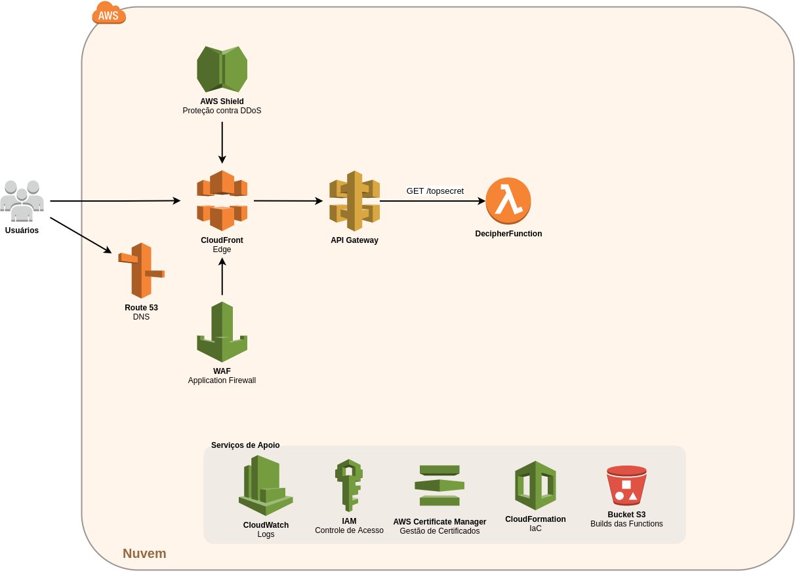
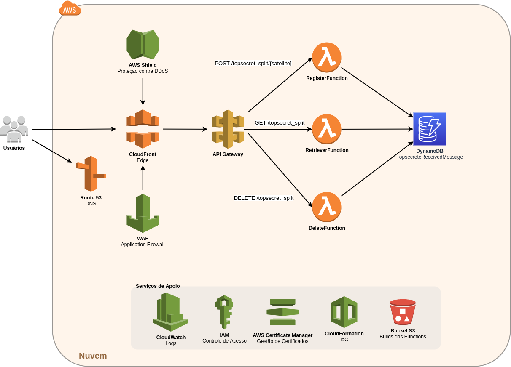

# Solução N2 e N3

## Arquitetura de Solução

Arquitetura cloud-native serverless com banco de dados NoSQL baseado em chave-valor em nuvem AWS. Foi adotada essa arquitetura por ser horizontalmente escalável e requerer poucos esforços de operação.

### N2



### N3



### Componentes de Nuvem

* AWS Lambda
* Amazon DynamoDB
* Amazon API Gateway
* Amazon CloudFront
* AWS Web Application Firewall (WAF)
* AWS Shield
* Amazon CloudWatch
* Amazon CloudFormation
* Amazon S3
* Route 53
* AWS IAM
* AWS Certficate Manager

### Funções Serverless Lambda

A solução é composta por dois conjuntos de funções Lambda. A função _Stateless_ implementa o N2 do desafio. As funções _Stateful_ implementam o N3 do desafio. 

**Stateless**
* DecipherFunction

**Stateful**
* RegisterFunction
* RetrieverFunction
* DeleteFunction

Para decifrar novas mensagens transmitidas, é necessário remover o estado da aplicação, e por isso foi incluída a DeleteFunction, embora não fosse solicitado no desafio.

Uma solução melhor seria adicionar um identificador às mensagens recebidas pelos satélite (data/hora da transmissão, por exemplo) de forma que as mensagens recebidas por cada satélite possam ser agrupadas.

### DynamoDB

#### Tabela TopsecreteReceivedMessage (Schema V2)

| Campo      | Tipo        |
|------------|-------------|
| satellite  | S (string)  | 
| distance   | N (number)  |
| message    | L (list)    |

### API Gateway

Endpoints
|  Method   | Endpoint                 | Função            |
|------|-------------------------------|-------------------|
| POST | /topsecret                    | DecipherFunction  |
| GET  | /topsecret_split              | RetrieverFunction |
| POST | /topsecret_split/{satellite}  | RegisterFunction  |

[Especificação OpenAPI](openapi.yaml).

## Arquitetura da Aplicação (Lambda Functions)

#### Conceitos Empregados

* Arquitetura Hexagonal
* Serverless
* SOLID

#### Stack

* Java 11
* Quarkus
* GraalVM
* AWS DynamoDB

#### Bibliotecas Utilizadas

* Quarkus BOM
* Quarkus AWS Lambda
* Quarkus AWS DynamoDB
* AWS SDK URL Connector
* Lemmingapex Trilateration
* Gson
* Lombock
* JUnit

### Arquitetura Hexagonal

A arquitetura hexagonal tem por objetivo facilitar a evolução das lógica de negócio isolando o domínio de negócio das implementações técnicas, de forma que o serviço não dependa de como ele é exposto ou como os dados são persistidos, por exemplo.

#### Principais conceitos
* **Aplicação**: é o _core_ do sistema, contém serviços que orquestram as funcionalidades e manipulam as entidades. A Aplicação recebe comandos pelas Portas e envia solicitações a outros atores também através das Portas.
* **Portas**: interfaces de entrada e saída que definem o contrato de interação da aplicação com os adaptadores.
* **Adaptadores**: implementam as interfaces definidas pelas Portas e interagem com o mundo externo recebendo comandos, nas Portas de entrada, e enviando ou consultando dados nas Portas de saída.

#### Portas de entrada
* StatelessDecipherPort
* StatefulDecipherPort
* DeleteMessagesPort

#### Portas de saída
* MessageRepositoryPort
* SatelliteRepositoryPort

#### Adaptadores

| Nome       | Tipo   | Porta                                               |
|------------|--------|-----------------------------------------------------|
| Lambda     | Input  | Utiliza StatelessDecipherPort, StatefulDecipherPort |
| DynamoDB   | Ouput  | Implementa MessageRepositoryPort                    |
| Statellite | Output | Implementa SatelliteRepositoryPort                  | 


## Estrutura de Java Packages 

* adapter 
* * input
* * * lambda
* * output
* * * dynamodb
* * * satellite
* application
* * dto
* * entity
* * exception
* * port
* * * input
* * * output
* * service
* * * application
* * * domain

## Build

#### Requisitos

* OpenJDK 11
* Gradle 7.4
* Quarkus CLI 2.6
* GraalVM 22 (opcional)
* SAM CLI (opcional)

### JVM

```
$ ./gradlew build
```

### Native (utilizando GraalVM)

```
$ ./gradlew build -Dquarkus.package.type=native
```

### Invocação Local

As funções podem ser invocadas localmente através do SAM CLI. Existem payloads para cada função e com alguns cenários diferentes para a função RegisterFunction.

#### Decipher
```
$ sam local invoke "TopsecretStatefulDecipherRetrieve" -t template.jvm.yaml -e payload.decipher.json
```

#### Register (Kenobi)
```
$ sam local invoke "TopsecretStatefulDecipherRetrieve" -t template.jvm.yaml -e payload.register.kenobi.json
```

#### Register (Skywalker)
```
$ sam local invoke "TopsecretStatefulDecipherRetrieve" -t template.jvm.yaml -e payload.register.skywalker.json
```

#### Register (Kenobi)
```
$ sam local invoke "TopsecretStatefulDecipherRetrieve" -t template.jvm.yaml -e payload.register.kenobi.json
```

#### Register (Sato)
```
$ sam local invoke "TopsecretStatefulDecipherRetrieve" -t template.jvm.yaml -e payload.register.sato.json
```

#### Register (Obi-Wan)
```
$ sam local invoke "TopsecretStatefulDecipherRetrieve" -t template.jvm.yaml -e payload.register.obi-wan.json
```

#### Retriever
```
$ sam local invoke "TopsecretStatefulDecipherRetrieve" -t template.jvm.yaml -e payload.retriever.json
```

#### Delete
```
$ sam local invoke "TopsecretStatefulDecipherRetrieve" -t template.jvm.yaml -e payload.delete.json
```

Se a função tiver sido construída para GraalVM, o arquivo de template deve ser alterado para **template.native.yaml**.

## Deploy

### Requisitos
* AWS CLI instalado e configurado
* SAM CLI instalado

### Configurações

#### Variáveis de Ambiente

No arquivo template.[jvm|native].yaml

| Variável               | Valores                               | Descrição                                         |
|------------------------|---------------------------------------|---------------------------------------------------|
| quarkus_lambda_handler | decipher, register, retriever, delete | Indica qual handler a função Lambda deve invocar. |
| dynamodb_tablename     | TopSecretReceivedMessages (default)   | Nome da tabela do DynamoDB.                       |

### Deploy das Funções Lambda

Utilizando JVM
```
$ sam deploy -t template.jvm.yaml
```

Ou utilizando Native (GraalVM)
```
$ sam deploy -t template.native.yaml
```

### Provisionamento dos Demais Recursos de Nuvem

O provisionamento automatizado (IaC) não está concluído e os serviços abaixo precisam ser provisionados manualmente:

* Criar role no IAM com permissões ao DynamoDB
* Criar tabela DynamoDB
* Configurar API Gateway
* Configurar certificado TLS
* Criar CloudFront distribution
* Configurar Route 53 (DNS)

### Invocação Remota

As funções provisionadas podem ser invocadas remotamente conforme exemplo abaixo. 

#### Decipher
```
$ sam invoke "TopsecretStatefulDecipherRetrieve" -t template.jvm.yaml -e payload.decipher.json
```
